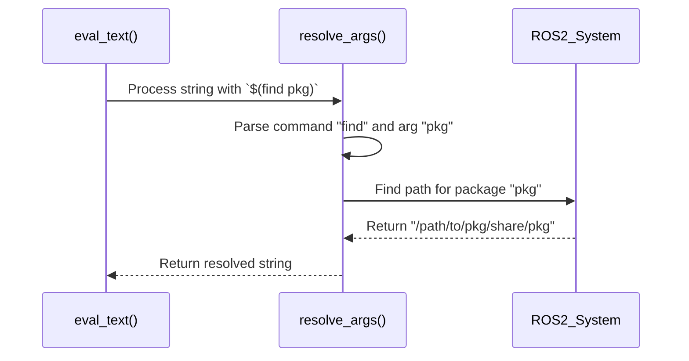

# Chapter 6: Substitution Arguments

In the [previous chapter](05_xml_dom_traversal___manipulation_.md), we learned how `xacro` walks through the in-memory **Document Object Model (DOM)** tree to process your file. So far, all the data we've used—properties, conditions, and macro parameters—has been defined inside the `.xacro` file itself.

But what if your robot model needs information from the *outside world*? What if you need to find the file path to another package, read a system environment variable, or pass in a configuration value from the command line? This is where Substitution Arguments come in.

### Why Do We Need This?

Imagine you are designing a robot arm and you want to load a 3D mesh file for one of its links. The mesh file, `arm_v2.stl`, lives inside another ROS 2 package called `my_robot_assets`.

You could try to hard-code the path:

```xml
<!-- This is fragile and will break on other computers! -->
<mesh filename="/home/sally/ros2_ws/src/my_robot_assets/meshes/arm_v2.stl" />
```

This is a terrible idea! This path will only work on Sally's computer. The moment you share this file with a teammate or try to build it in a different workspace, the path will be wrong and the model will fail to load.

We need a way for our `.xacro` file to ask the system, "Hey, where is the `my_robot_assets` package installed right now?" Substitution arguments are the tool for asking these kinds of questions.

### The Solution: The `$(...)` Syntax

`xacro` provides a special syntax, `$(...)`, that acts as a set of commands to query the outside world. This is different from the `${...}` syntax we've been using, which evaluates expressions using variables defined *inside* the file.

-   `${...}` looks **inside** the xacro context for properties.
-   `$(...)` looks **outside** the file to the surrounding system.

Think of `$(...)` as a direct line to your operating system and build environment. Let's explore the three most important commands.

#### 1. Finding Packages with `$(find ...)`

This is the solution to our mesh file problem. The `$(find PKG_NAME)` command asks the ROS 2 build system to find the installation path of a package.

Let's fix our example:

```xml
<!-- This is portable and works everywhere! -->
<mesh filename="$(find my_robot_assets)/meshes/arm_v2.stl" />
```

When `xacro` processes this line, it will:
1.  See `$(find my_robot_assets)`.
2.  Ask the system for the path to the `my_robot_assets` package.
3.  Get back a result like `/home/sally/ros2_ws/install/my_robot_assets/share/my_robot_assets`.
4.  Substitute this path back into the string.

**Input (`robot.xacro`)**
```xml
<robot xmlns:xacro="http://www.ros.org/wiki/xacro">
  <link name="arm_link">
    <visual>
      <geometry>
        <mesh filename="$(find my_robot_assets)/meshes/arm_v2.stl" />
      </geometry>
    </visual>
  </link>
</robot>
```

**Output (after running `xacro`)**
```xml
<?xml version="1.0" ?>
<!-- ... -->
<robot>
  <link name="arm_link">
    <visual>
      <geometry>
        <mesh filename="/path/to/install/my_robot_assets/share/my_robot_assets/meshes/arm_v2.stl" />
      </geometry>
    </visual>
  </link>
</robot>
```
The final XML has a full, absolute path, making your robot model robust and shareable.

#### 2. Reading Environment Variables with `$(env ...)`

Sometimes, you need to get information from a system environment variable. The `$(env VAR_NAME)` command lets you do this. A common use case is finding a user's home directory.

```xml
<!-- Include a user-specific configuration file -->
<xacro:include filename="$(env HOME)/.robot_configs/my_arm.xacro" />
```

Here, `$(env HOME)` will be replaced by the value of the `HOME` environment variable (e.g., `/home/sally`), allowing you to load user-specific files.

#### 3. Using Command-Line Arguments with `$(arg ...)`

This is one of the most powerful features. It allows you to create highly configurable models by passing in values when you run `xacro`.

Let's say we want to be able to change our robot's color from the command line.

**Step 1: Declare the Argument**

First, you need to tell your `.xacro` file to expect an argument using the `<xacro:arg>` tag. You should provide a `name` and a `default` value.

```xml
<!-- At the top of your file, declare the arguments you accept -->
<xacro:arg name="robot_color" default="blue" />
```
This tells `xacro`: "There's an argument called `robot_color`. If the user doesn't provide one, use `blue`."

**Step 2: Use the Argument**

Now you can use `$(arg robot_color)` anywhere in your file.

```xml
<!-- A material block that uses the argument -->
<material name="robot_material">
  <color rgba="${'1 0 0 1' if '$(arg robot_color)' == 'red' else '0 0 1 1'}" />
</material>
```
This example uses a small Python expression inside `${...}` to set the color based on the string value of our argument.

**Step 3: Provide the Value on the Command Line**

When you run `xacro`, you can now pass a value for `robot_color` using the `name:=value` syntax.

```bash
# Process the file, overriding the default color
xacro my_robot.xacro robot_color:=red
```

If you run this command, `$(arg robot_color)` will be replaced with `"red"`, and the resulting material color will be red. If you omit `robot_color:=red`, it will use the default `"blue"`.

### How Does It Work Under the Hood?

The substitution argument mechanism is separate from the property evaluation system. When `xacro`'s text evaluator (`eval_text`) finds a `$(...)` pattern, it knows this is a special request for the "outside world."

1.  The `eval_text` function scans a string and identifies a substitution pattern like `$(find my_pkg)`.
2.  Instead of looking in the [Symbol Table & Scoping](07_symbol_table___scoping_.md), it passes the entire string to a dedicated handler function called `resolve_args` located in `xacro/substitution_args.py`.
3.  `resolve_args` acts like a router. It looks at the first word inside the parentheses (e.g., `find`, `env`, `arg`).
4.  It calls a specific helper function for that command (e.g., `_find`, `_env`, `_arg`).
5.  The helper function does the real work:
    -   `_find` calls a ROS 2 function to look up the package path.
    -   `_env` reads from the operating system's environment variables.
    -   `_arg` looks up the value in a special dictionary that was populated with the command-line arguments.
6.  The result is returned all the way back and substituted into the original string.

This flow ensures that requests for outside information are handled by a dedicated and secure part of the system.



#### A Glimpse at the Code

The logic is neatly organized in `xacro/substitution_args.py`. The main router function, `_resolve_args`, dispatches tasks to the helpers.

```python
# A simplified view from xacro/substitution_args.py
def _resolve_args(arg_str, context, commands):
    resolved = arg_str
    # Find all $(...) patterns in the string
    for a in _collect_args(arg_str):
        # splits is e.g., ['find', 'my_pkg']
        splits = [s for s in a.split(' ') if s]
        command = splits[0]
        args = splits[1:]
        
        # Call the correct helper function from the 'commands' dictionary
        if command in commands:
            resolved = commands[command](resolved, a, args, context)
    return resolved
```
Each helper function performs a simple, specific task. For example, the `_find` helper is a thin wrapper around a ROS 2 function.

```python
# A simplified view from xacro/substitution_args.py
def _eval_find(pkg):
    # This is the ROS 2 function that does the actual work
    return get_package_share_directory(pkg)

def _find(resolved, a, args, context):
    # ... error checking ...
    # Replace the $(...) pattern with the result of the lookup
    return resolved.replace('$(%s)' % a, _eval_find(args[0]))
```

The `eval_text` function in `xacro/__init__.py` is responsible for kicking off this whole process when it sees a `$(...)` pattern.

### Conclusion

You've just learned how to connect your `.xacro` files to the world outside!

-   Substitution arguments use the **`$(...)`** syntax.
-   **`$(find my_pkg)`** finds the path to ROS 2 packages, making your models portable.
-   **`$(env VAR)`** reads system environment variables.
-   **`$(arg my_arg)`** lets you pass in values from the command line, making your models configurable.

This mechanism is the key to integrating your `xacro` models into a larger build and launch system. It allows you to create flexible, reusable robot descriptions that don't rely on hard-coded, brittle paths.

We've now seen how `xacro` stores internal variables (`${...}`) and gets external ones (`$(...)`). But how does it keep them all straight, especially inside macros? The next chapter dives into the rules that govern where variables live and how they are looked up.

Next, we'll explore the [Symbol Table & Scoping](07_symbol_table___scoping_.md).

---

Generated by [AI Codebase Knowledge Builder](https://github.com/The-Pocket/Tutorial-Codebase-Knowledge)