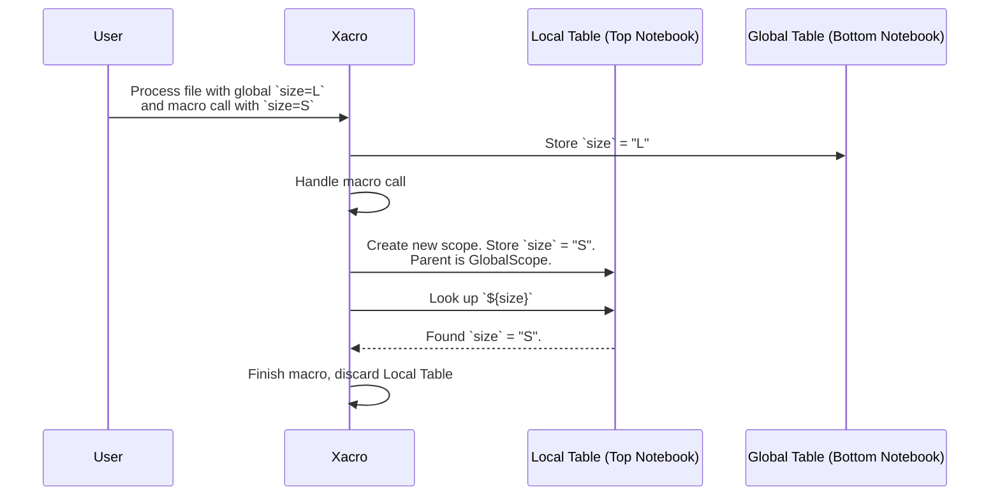

# Chapter 7: Symbol Table & Scoping

In the [previous chapter](06_substitution_arguments_.md), we learned how to pull in data from the outside world using Substitution Arguments like `$(find ...)` and `$(arg ...)`. We now have two ways to get variables: from inside the file using `<xacro:property>` (`${...}`) and from outside using `$(...)`.

But what happens when you have a complex robot with many files and macros? What if a macro defines a property named `size`, and you also have a global property named `size`? How does `xacro` know which one to use? This chapter explains the clever system `xacro` uses to manage all its variables: the **Symbol Table** and its rules of **Scoping**.

### Why Do We Need This?

Imagine you are writing a macro to create a simple box link. The macro needs a parameter to define its dimensions, which you decide to call `size`.

```xml
<xacro:macro name="create_box" params="size">
  <link name="my_box">
    <visual>
      <geometry>
        <box size="${size}" />
      </geometry>
    </visual>
  </link>
</xacro:macro>
```

Elsewhere in your file, you have a global property, also coincidentally named `size`, that describes the overall size of your robot.

```xml
<xacro:property name="size" value="large" />
```

Now, what happens when you call your macro?
```xml
<!-- What will the box size be? "0.1 0.1 0.1" or "large"? -->
<xacro:create_box size="0.1 0.1 0.1" />
```
If `xacro` wasn't careful, the macro's `size` could overwrite the global `size`, or vice-versa, leading to chaos. We need a system that keeps variables organized and prevents them from interfering with each other. This system is called **scoping**.

### The Solution: A Stack of Notebooks

The best way to think about `xacro`'s scoping system is as a **stack of notebooks**.

1.  **The Global Notebook**: When `xacro` starts, it opens a big notebook for all your global properties. This notebook sits at the bottom of the stack.
2.  **The Local Notebook**: Every time you call a macro, `xacro` takes out a *new, temporary notebook* and places it on top of the stack. It writes all the macro's parameters (like `size="0.1 0.1 0.1"`) in this new notebook.
3.  **The Lookup Rule**: When `xacro` needs to find the value of a variable (like `${size}`), it **always starts looking in the top notebook**.
    -   If it finds the variable there, it uses that value and stops looking.
    -   If it's *not* in the top notebook, it puts that notebook aside and checks the one underneath it.
    -   It continues this process until it finds the variable or runs out of notebooks.
4.  **Tidying Up**: Once the macro is finished, `xacro` simply throws away the temporary top notebook. The notebook underneath (the global one) is completely untouched.

Let's apply this to our example.

#### The Setup
```xml
<robot xmlns:xacro="http://www.ros.org/wiki/xacro">
  <!-- This goes into the Global Notebook at the bottom of the stack -->
  <xacro:property name="robot_size" value="large" />

  <xacro:macro name="create_box" params="size">
    <!-- This expression looks up 'size' from the stack of notebooks -->
    <link name="my_box">
      <box size="${size}" />
    </link>
  </xacro:macro>

  <!-- This is the macro call -->
  <xacro:create_box size="0.1 0.1 0.1" />
</robot>
```

#### The Process

1.  `xacro` starts and creates the **Global Notebook**. It writes `robot_size: "large"` in it.
2.  `xacro` sees the macro call `<xacro:create_box size="0.1 0.1 0.1" />`.
3.  It creates a **new Local Notebook** for this call and places it on top of the Global one. In this new notebook, it writes `size: "0.1 0.1 0.1"`.
4.  Now it processes the macro's content. It encounters `<box size="${size}" />`.
5.  **Lookup time!** It asks, "What is `size`?"
    -   It checks the top notebook (the Local one). It finds `size` right away! The value is `"0.1 0.1 0.1"`.
    -   It stops looking and uses this value. It never even looks in the Global Notebook.
6.  The macro expansion is finished. `xacro` **throws away the Local Notebook**.
7.  The process is complete. The Global Notebook, with its `robot_size` property, was never affected.

**Output (after running `xacro`)**
```xml
<?xml version="1.0" ?>
<!-- ... -->
<robot>
  <link name="my_box">
      <box size="0.1 0.1 0.1" />
  </link>
</robot>
```
The system worked perfectly! The local macro parameter `size` was used inside the macro, and it didn't interfere with any global variables. This allows you to write self-contained, reusable macros without worrying about what variables are named elsewhere.

### How Does It Work Under the Hood?

Internally, `xacro` implements this "stack of notebooks" using a special dictionary-like object called a `Table`. A `Table` is just a dictionary that has a pointer to its **parent**.

When `xacro` needs to look up a variable, it checks the current `Table`. If the variable isn't there, it just asks its parent. This creates a "chain of command" that perfectly mirrors our stack of notebooks.

1.  **Macro Call**: When a macro is called, a new `Table` is created. Its `parent` is set to the `Table` that was active before the call (e.g., the global one).
2.  **Lookup**: The `__getitem__` method (what Python uses for `table['key']`) is implemented to first check its own dictionary, and if it fails, it calls `self.parent['key']`.
3.  **Completion**: When the macro is done, the reference to this new `Table` is simply discarded.

This chain reaction is shown in the diagram below.



#### A Glimpse at the Code

The core of this mechanism is the `Table` class in `xacro/__init__.py`. Here is a simplified version of its structure:

```python
# A simplified view from xacro/__init__.py
class Table(dict):
    def __init__(self, parent=None):
        dict.__init__(self)
        # Each "notebook" knows about the one below it.
        self.parent = parent

    def __getitem__(self, key):
        # First, look in the current notebook.
        if dict.__contains__(self, key):
            return dict.__getitem__(self, key)
        else:
            # If not found, ask the parent notebook.
            return self.parent[key]
```
This elegant structure creates the lookup chain.

The creation of the new "local notebook" happens in the `handle_macro_call` function. You can see the exact line where the new scope is born:

```python
# A simplified view from xacro/__init__.py
def handle_macro_call(node, macros, symbols):
    # ...
    # 'symbols' is the current active notebook (e.g., Global Table)
    
    # Create a new, temporary notebook for this call.
    # Its parent is the currently active notebook.
    scoped_symbols = Table(symbols)

    # Fill the new notebook with parameters from the macro call
    for name, value in node.attributes.items():
        scoped_symbols[name] = eval_text(value, symbols)

    # Process the macro's body using the new notebook
    eval_all(body, macros, scoped_symbols)
    # ...
```
This `scoped_symbols` object is the temporary "local notebook" that only exists for the duration of the macro call.

### Conclusion

You've now reached the end of the `xacro` internals tutorial and have mastered the final core concept!

-   **Scoping** is the system that prevents variable name collisions.
-   It works like a **stack of notebooks**: a global scope at the bottom and temporary, local scopes added on top for each macro call.
-   When looking up a variable, `xacro` always starts from the **top notebook** and works its way down.
-   This ensures that macros are self-contained and predictable, making your robot descriptions modular and robust.

Congratulations! You've journeyed through the entire `xacro` processing pipeline, from simple properties and expressions to the sophisticated scoping rules that hold it all together. You now have a deep understanding of how `xacro` transforms your clean, modular `.xacro` files into the standard XML that brings your robot models to life. Happy building

---

Generated by [AI Codebase Knowledge Builder](https://github.com/The-Pocket/Tutorial-Codebase-Knowledge)