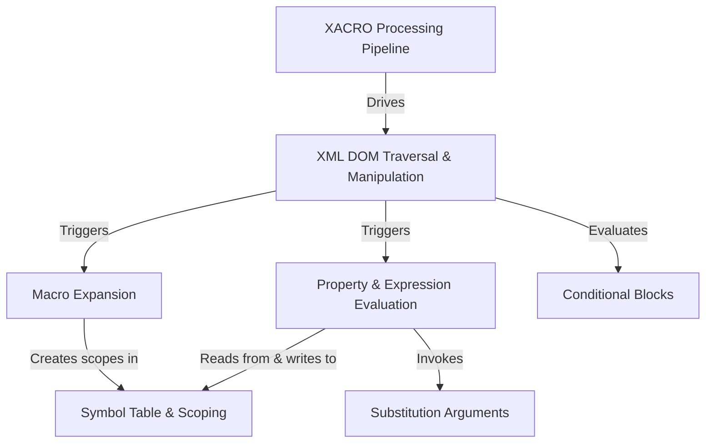

# Tutorial: xacro

XACRO is a tool that enhances XML files by adding powerful new features. It acts like a pre-processor, taking a `.xacro` file as input and generating a standard, clean XML output.
Its main purpose is to make XML files more readable, maintainable, and configurable by introducing concepts like **macros** for reusable code blocks, **properties** (*variables*) and Python *expressions* for dynamic values, and **conditional blocks** for logic-based inclusion of content. This is especially useful for defining complex robot models in robotics.

**Source Repository:** [None](None)

## Chapters

1. [Property & Expression Evaluation
](01_property___expression_evaluation_.md)
2. [Conditional Blocks
](02_conditional_blocks_.md)
3. [Macro Expansion
](03_macro_expansion_.md)
4. [XACRO Processing Pipeline
](04_xacro_processing_pipeline_.md)
5. [XML DOM Traversal & Manipulation
](05_xml_dom_traversal___manipulation_.md)
6. [Substitution Arguments
](06_substitution_arguments_.md)
7. [Symbol Table & Scoping
](07_symbol_table___scoping_.md)

---

Generated by [AI Codebase Knowledge Builder](https://github.com/The-Pocket/Tutorial-Codebase-Knowledge)