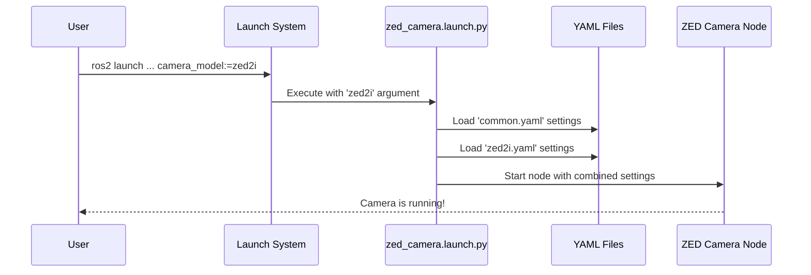

# Chapter 1: Launch & Configuration System

Welcome to the official tutorial for the `zed-ros2-wrapper`! If you're excited to get your ZED camera working with ROS 2, you're in the right place. This first chapter will introduce you to the most important concept for getting started: the Launch and Configuration system.

### The "Control Panel" for Your Camera

Imagine you've just unboxed your new ZED 2i camera. You want to connect it to your robot and start seeing the world through its eyes. But how do you tell it what to do? How do you change the video resolution, turn on depth sensing, or enable the object detection feature?

You could change the source code, but that's complicated and risky. Instead, this project provides a powerful and easy-to-use "control panel" that lets you configure everything without writing a single line of code. This control panel is ROS 2's **Launch & Configuration System**.

Think of it this way:
*   The **Launch File** (`zed_camera.launch.py`) is the **ignition key** for your camera. It starts everything up.
*   The **Configuration Files** (`.yaml` files) are the **settings menu**. This is where you flick switches (like `od_enabled: true`) and turn dials (like `grab_frame_rate: 60`) to customize how the camera behaves.

This chapter will teach you how to use this system to start your camera and tailor it to your needs.

### The Key Components

Our control panel has two main parts that work together:

1.  **`zed_camera.launch.py` (The Ignition Key):** This is the single, central script you run from your terminal to bring the ZED camera node to life. It's responsible for reading your settings and starting the necessary programs.

2.  **YAML Configuration Files (The Settings Menu):** These are simple, human-readable text files located in the `zed_wrapper/config` directory. They hold all the possible settings for the camera. They are split into two types:
    *   `common.yaml`: Contains settings that are shared across *all* ZED camera models, like enabling object detection or positional tracking.
    *   Camera-specific files (`zed2.yaml`, `zed2i.yaml`, `zedx.yaml`, etc.): Contain settings unique to a particular camera model, such as the default resolution or minimum depth distance.

### A Practical Example: Starting Your ZED 2i

Let's walk through a common task: starting your ZED 2i camera.

#### Step 1: The Launch Command

Open a terminal and run the following command. This is the fundamental command you will use most of the time.

```bash
ros2 launch zed_wrapper zed_camera.launch.py camera_model:=zed2i
```

Let's break that down:
*   `ros2 launch`: This is the standard ROS 2 command to run a launch file.
*   `zed_wrapper`: This is the name of our ROS 2 package.
*   `zed_camera.launch.py`: This is our "ignition key" file.
*   `camera_model:=zed2i`: This is a crucial argument! We are telling the launch file, "Hey, I have a ZED 2i camera." The launch file will use this information to load the correct settings.

When you run this, the launch file starts the camera node, loading the default settings from `common.yaml` and `zed2i.yaml`. Your camera is now running and publishing data to ROS 2 topics!

#### Step 2: Customizing Settings

The default settings are great, but what if you want to change something? Let's say you want to enable Object Detection. You could edit `common.yaml`, but we have a better way that won't get overwritten when you update the software.

We'll create a custom settings file.

1.  Create a new file anywhere you like, for example, in your home directory. Let's name it `my_zed_settings.yaml`.

2.  Open the file and add the settings you want to change. We want to enable object detection (`od_enabled`) and also change the depth mode to be faster (`PERFORMANCE`).

    ```yaml
    # my_zed_settings.yaml
    
    /**:
        ros__parameters:
            object_detection:
                od_enabled: true
            depth:
                depth_mode: "PERFORMANCE"
    ```
    This file overrides only the parameters you specify, leaving all others at their default values.

3.  Now, launch the camera again, but this time, tell the launch file where to find your custom settings.

    ```bash
    ros2 launch zed_wrapper zed_camera.launch.py \
      camera_model:=zed2i \
      ros_params_override_path:=/path/to/your/my_zed_settings.yaml
    ```
    *(Remember to replace `/path/to/your/` with the actual path to your file!)*

And that's it! The ZED node will now start with object detection enabled and a faster depth mode. This method is the recommended way to manage your custom configurations.

### Under the Hood

So what's actually happening when you run that command? Let's peek behind the curtain.

#### The Flow of Information

The process follows a clear sequence, which we can visualize.



1.  You execute the `ros2 launch` command.
2.  The launch system runs our `zed_camera.launch.py` script.
3.  The script reads the `camera_model` argument you provided (`zed2i`).
4.  It first loads the default settings from `common.yaml`.
5.  Then, it loads the settings from the camera-specific file, `zed2i.yaml`. These settings are layered on top, overriding any common ones if there's a conflict.
6.  If you provided a `ros_params_override_path`, those settings are loaded last, giving them the final say.
7.  Finally, it starts the main [ZED Camera Node Component](02_zed_camera_node_component_.md), handing it this final, combined list of settings.

#### A Glimpse at the Code

You don't need to understand this code to use the wrapper, but seeing it can help connect the dots. Here are a few key snippets from `zed_wrapper/launch/zed_camera.launch.py`.

First, the script declares the `camera_model` argument, making it available on the command line.

```python
# zed_wrapper/launch/zed_camera.launch.py

# ...
DeclareLaunchArgument(
    'camera_model',
    description='[REQUIRED] The model of the camera.',
    choices=['zed', 'zedm', 'zed2', 'zed2i', 'zedx', 'zedxm', 'virtual']
),
# ...
```
This is how the launch file knows to listen for `camera_model:=...` and what the valid options are.

Next, it uses the value you provide to build the path to the correct camera-specific configuration file.

```python
# zed_wrapper/launch/zed_camera.launch.py

# ...
camera_model_val = camera_model.perform(context)

config_camera_path = os.path.join(
    # ... gets the path to the 'zed_wrapper' package ...
    'config',
    camera_model_val + '.yaml' # e.g., 'zed2i.yaml'
)
# ...
```
This simple piece of code is what makes the whole system dynamic and able to support multiple camera models.

Finally, it gathers all the configuration files into a list and passes them to the node when it starts.

```python
# zed_wrapper/launch/zed_camera.launch.py

# ...
node_parameters = [
        config_common_path,  # Common parameters are loaded first
        config_camera_path,  # Camera-specific params are loaded second
        # ... other overrides can be added here
    ]

zed_wrapper_node = Node(
    # ...
    parameters=node_parameters
)
# ...
```
The order here is important! Parameters loaded later in the list will override those loaded earlier. This is how `zed2i.yaml` can specify a different `min_depth` than `common.yaml`.

### Conclusion

You've just learned the most fundamental concept of the `zed-ros2-wrapper`: the Launch and Configuration system. You now know:
*   The system acts as a "control panel" for the camera.
*   You start everything using the `zed_camera.launch.py` file.
*   You must specify your camera model using the `camera_model` argument.
*   All settings are stored in `.yaml` files, and you can create your own override file to customize them cleanly.

With this knowledge, you are ready to start, stop, and configure your ZED camera for any project.

Now that we understand *how* to launch the camera node, let's learn more about what that node actually is and what it does. In the next chapter, we will explore the heart of the wrapper: the [ZED Camera Node Component](02_zed_camera_node_component_.md).

---

Generated by [AI Codebase Knowledge Builder](https://github.com/The-Pocket/Tutorial-Codebase-Knowledge)