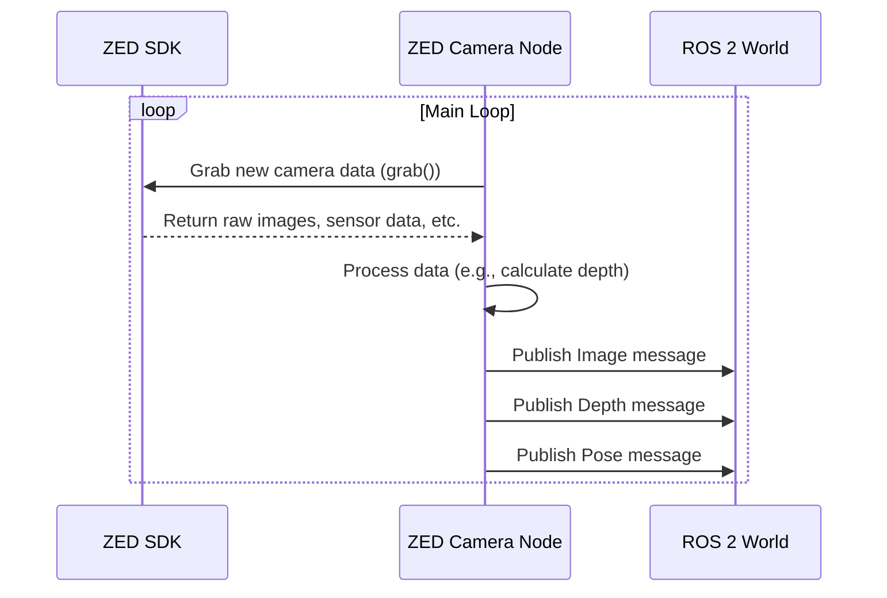

# Chapter 2: ZED Camera Node Component

In the [Launch & Configuration System](01_launch___configuration_system_.md) chapter, we learned how to use a launch file to start the ZED camera. It was like turning the ignition key in a car. But what exactly did we start? What is the "engine" that roars to life?

That engine is the **ZED Camera Node Component**. This chapter will introduce you to the heart of the `zed-ros2-wrapper`.

### The Camera's Translator

Imagine your ZED camera is a brilliant expert who only speaks a very specific technical language, the "ZED SDK language." On the other hand, your robot's navigation system, your visualization tools, and all your other programs speak a universal language called "ROS 2." They can't understand the camera directly.

The **ZED Camera Node Component** is the master translator that sits between them.


It's a C++ application whose only job is to:
1.  **Listen** to everything the camera says in "ZED SDK language."
2.  **Translate** it into the "ROS 2 language" (messages, topics, and services).
3.  **Broadcast** it for any other ROS 2 program to hear and understand.

This node is the bridge that makes it possible for the ZED camera's advanced features to be used by the entire ROS 2 ecosystem.

### What Does the Translator Do All Day?

When you run the launch command, the ZED Camera Node Component starts up and immediately gets to work. It runs in a continuous loop, performing a few key tasks over and over again, many times per second:

*   **Initial Handshake:** The first thing it does is connect to the physical camera over USB, using the settings you provided in the `.yaml` files. It says, "Hello ZED 2i, please wake up and set your resolution to 1080p and your frame rate to 30."
*   **Grab New Data:** In its main loop, it constantly asks the camera, "Do you have a new frame for me?" The camera provides the latest left and right images, sensor data, and more.
*   **Process with the SDK:** This is where the magic happens. The node uses the ZED SDK's powerful functions to process the raw data. It might calculate a depth map, figure out where the camera is in the world (positional tracking), or detect objects in the scene.
*   **Publish for Everyone:** Finally, it packages this processed information into standard ROS 2 message formats and publishes it on various "topics" (think of these as radio channels). One topic might broadcast the color image, another the depth map, and yet another the camera's position.

### A Practical Example: Seeing the Data Flow

Let's see this in action. In Chapter 1, you ran this command:

```bash
ros2 launch zed_wrapper zed_camera.launch.py camera_model:=zed2i
```

This starts the ZED Camera Node Component. The node is now running and silently broadcasting all the camera data. How can we check? We can use some built-in ROS 2 tools to listen in on those "radio channels" (topics).

1.  **List the available topics.** Open a new terminal (while the launch command is still running in the first one) and type:

    ```bash
    ros2 topic list
    ```

    You will see a long list of topics that the node is publishing. This is proof that the translator is working!

    ```text
    /clicked_point
    /diagnostics
    /parameter_events
    /rosout
    /tf
    /tf_static
    /zed/zed_node/body_trk/skeletons
    /zed/zed_node/depth/camera_info
    /zed/zed_node/depth/depth_registered
    /zed/zed_node/imu/data
    /zed/zed_node/left/camera_info
    /zed/zed_node/left/image_rect_color
    /zed/zed_node/odom
    /zed/zed_node/point_cloud/cloud_registered
    /zed/zed_node/pose
    # ... and many more
    ```
    Notice how they are neatly organized. For example, `/zed/zed_node/depth/depth_registered` is the channel for depth information, and `/zed/zed_node/left/image_rect_color` is for the left camera's color image.

2.  **Listen to a specific topic.** Let's peek at the data being sent on the color image topic.

    ```bash
    ros2 topic echo /zed/zed_node/left/image_rect_color
    ```
    Your terminal will be flooded with a stream of numbers. This might look like nonsense, but it's the raw image data, perfectly formatted for another ROS 2 program (like a display tool or a computer vision algorithm) to read. You've just intercepted a message from our translator!

### Under the Hood

You don't need to be a C++ programmer to use the wrapper, but a quick peek behind the curtain can help you understand what's really going on.

#### The Data Flow Loop

The process inside the node follows a clear, repeating pattern.


This loop is the heartbeat of the entire system. It grabs data from the hardware via the SDK, processes it, and sends it out to the rest of ROS 2.

#### A Glimpse at the Code

Let's look at two tiny snippets of code to see how this is implemented.

First, the program's main entry point. This file is like the front door to the application. Notice how simple it is: its main job is to create and run our `ZedCamera` component.

```cpp
// File: zed_wrapper/src/zed_wrapper.cpp

int main(int argc, char * argv[])
{
  // ... initialize ROS 2 ...
  rclcpp::init(argc, argv);

  // Create the main camera node object
  auto zed_node = std::make_shared<stereolabs::ZedCamera>(options);
  
  // Start the node and let it run
  exec.spin();

  rclcpp::shutdown();
  return 0;
}
```

All the real work happens inside the `ZedCamera` class. One of its most important helper functions is the one that performs the "translation" for images.

This function takes an image in the ZED SDK's internal format (`sl::Mat`) and converts it into a standard ROS 2 `Image` message.

```cpp
// File: zed_components/src/tools/src/sl_tools.cpp

std::unique_ptr<sensor_msgs::msg::Image> imageToROSmsg(
  const sl::Mat & img, // Input: ZED SDK image
  // ... other parameters
)
{
  // Create an empty ROS 2 Image message
  auto imgMessage = std::make_unique<sensor_msgs::msg::Image>();

  // Copy information like height and width
  imgMessage->height = img.getHeight();
  imgMessage->width = img.getWidth();
  
  // Copy the actual pixel data
  imgMessage->data = std::vector<uint8_t>(/* ... data from img ... */);

  // Return the finished ROS 2 message
  return imgMessage;
}
```
This function is a perfect example of the node's role as a translator. It carefully repackages the data from one format to another, ensuring the rest of the ROS 2 world can understand it perfectly.

### Conclusion

You now understand the central component of the `zed-ros2-wrapper`. You've learned that:
*   The **ZED Camera Node Component** is the core C++ application that acts as a translator.
*   It connects the ZED SDK to the ROS 2 ecosystem.
*   It runs in a continuous loop to grab, process, and publish camera data.
*   This data is broadcast on ROS 2 topics, which other nodes can subscribe to.

We've seen that the node publishes data in the form of "messages." But what is the exact structure of these messages? What kind of information is inside a "Depth" message or a "Pose" message?

In the next chapter, we will explore the [ZED Custom Interfaces (API)](03_zed_custom_interfaces__api__.md) to understand the vocabulary our translator uses.

---

Generated by [AI Codebase Knowledge Builder](https://github.com/The-Pocket/Tutorial-Codebase-Knowledge)