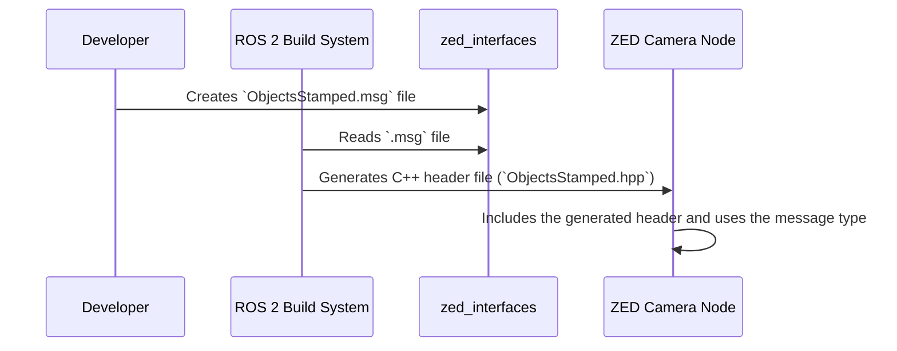

# Chapter 3: ZED Custom Interfaces (API)

In the previous chapter on the [ZED Camera Node Component](02_zed_camera_node_component_.md), we learned that the node acts as a translator, converting data from the ZED SDK into ROS 2 messages. For standard data like a color video stream, it uses a standard ROS 2 message type, `sensor_msgs/Image`, which is like a plain piece of paper anyone can read.

But what happens when the camera produces something far more complex, like a list of all the people it sees, including their 3D position and the exact location of their elbows and knees? A plain piece of paper isn't good enough. You need a specialized form with dedicated fields for each piece of information. This chapter is all about those special forms: the **ZED Custom Interfaces**.

### Why Special "Forms" Are Needed

Imagine you go to a doctor. For a simple note, they might use a blank prescription pad. But for a full check-up, they use a detailed medical chart with specific boxes for your height, weight, blood pressure, and medical history.

The ZED camera's AI features, like Object Detection and Body Tracking, produce data that is just as structured and complex. A standard `Image` message can't hold a 3D bounding box, a skeleton's joint positions, or an object's velocity.

To solve this, the `zed-ros2-wrapper` comes with its own set of custom "forms" – specialized message and service definitions – that perfectly match the complex data from the ZED SDK. These definitions create a unique **Application Programming Interface (API)** for the camera, allowing it to communicate its most advanced insights to the rest of the ROS 2 world.

All of these custom definitions live in a separate package called `zed_interfaces`.

### The Key Components

Our custom API is built on two main ideas:

1.  **Standard Interfaces (`sensor_msgs`, `geometry_msgs`):** The wrapper uses these for all the common data types.
    *   `sensor_msgs/Image`: For color and depth images.
    *   `sensor_msgs/PointCloud2`: For 3D point clouds.
    *   `geometry_msgs/PoseStamped`: For the camera's position.
    *   ...and so on. These are the "plain paper" messages that are universally understood in ROS.

2.  **Custom Interfaces (`zed_interfaces`):** The wrapper uses these for unique ZED SDK data structures.
    *   `zed_interfaces/ObjectsStamped`: A list of all objects detected in the scene.
    *   `zed_interfaces/Skeleton3D`: The 3D position of all the joints of a detected person.
    *   These are the "specialized forms" designed to hold data that standard messages cannot.

Let's see how this works in practice by looking at the data from the Object Detection module.

### A Practical Example: Inspecting a Detected Object

Our goal is to see the structured data for objects the camera detects.

#### Step 1: Enable Object Detection

First, we need to tell the camera to turn on its object detection module. As we learned in Chapter 1, we can do this with a custom configuration file.

1.  Create a file named `my_od_settings.yaml`.
2.  Add the following content to enable object detection:
    ```yaml
    # my_od_settings.yaml
    /**:
        ros__parameters:
            object_detection:
                od_enabled: true
    ```

#### Step 2: Launch the Camera Node

Now, start the camera, telling it to use your new settings file.

```bash
ros2 launch zed_wrapper zed_camera.launch.py \
  camera_model:=zed2i \
  ros_params_override_path:=/path/to/your/my_od_settings.yaml
```

The camera node is now running and publishing detected object data.

#### Step 3: Find the Topic and its "Form"

Let's use ROS 2 command-line tools to investigate.

1.  In a new terminal, find the topic where object data is published.

    ```bash
    ros2 topic list | grep objects
    ```
    You will see a topic like `/zed/zed_node/obj_det/objects`.

2.  Now, check the "form" (the message type) used on that topic.

    ```bash
    ros2 topic info /zed/zed_node/obj_det/objects
    ```
    The output will clearly show that this is not a standard message type:
    ```text
    Type: zed_interfaces/msg/ObjectsStamped
    Publisher count: 1
    Subscriber count: 0
    ```
    This confirms the node is using a custom interface from the `zed_interfaces` package.

#### Step 4: Examine the "Form's" Structure

What fields are on this custom form? We can ask ROS 2 to show us the definition.

```bash
ros2 interface show zed_interfaces/msg/ObjectsStamped
```

The output shows the blueprint for the message. It has a header (for the timestamp) and then a list of individual `Object` messages.

```text
# Standard ROS 2 header
std_msgs/Header header

# Array of detected objects
zed_interfaces/Object[] objects
```

But what's inside an `Object`? Let's look at that "form" too.

```bash
ros2 interface show zed_interfaces/msg/Object
```

Now we see the rich, structured data for a single detected object!

```text
# Object label
string label

# Object detection confidence
float32 confidence

# 3D bounding box
zed_interfaces/BoundingBox3D bounding_box_3d

# 3D position of the object
float32[3] position

# Skeletons for persons
zed_interfaces/Skeleton3D skeleton_3d
# ... and more fields
```
This is our specialized form. It has specific fields for the object's name (`label`), how sure the AI is (`confidence`), its 3D bounding box, and even its skeleton if the object is a person.

This structured format is incredibly powerful because any other ROS 2 program can subscribe to this topic and immediately know how to access every piece of this complex data cleanly.

### Under the Hood

How does a "custom form" go from a text file definition to a real data structure used in the C++ code?

#### The Flow of Information

The process is managed entirely by the ROS 2 build system.



1.  A developer defines the message structure in a simple `.msg` file.
2.  When you run `colcon build`, ROS 2 tools find this file and automatically generate the corresponding C++ (and Python) code.
3.  The main [ZED Camera Node Component](02_zed_camera_node_component_.md) can then simply include this auto-generated code to create, fill, and publish messages of this custom type.

#### A Glimpse at the Code

Let's look at the simple text file that defines our "form." This is the blueprint.

```idl
# File: zed-ros2-interfaces/zed_interfaces/msg/ObjectsStamped.msg

# Standard ROS 2 header for timestamp and frame ID
std_msgs/Header header

# An array (a list) of detected objects.
# 'Object' is another custom message type.
zed_interfaces/Object[] objects
```
This file is incredibly simple. It just declares the fields and their types. The ROS 2 build system does all the heavy lifting to turn this into usable code.

Inside the ZED node's C++ code, the translator function uses this generated code to fill out the form with data from the SDK.

```cpp
// Simplified snippet from the ZED Camera Node

// 1. Create a new, empty "form" (message)
auto objects_msg = std::make_unique<zed_interfaces::msg::ObjectsStamped>();

// 2. For each object the ZED SDK found...
for (const auto &sdk_obj : sdk_detected_objects) {
  zed_interfaces::msg::Object ros_obj; // Create a single object sub-form
  
  // 3. Fill in the fields
  ros_obj.label = sdk_obj.label;
  ros_obj.confidence = sdk_obj.confidence;
  // ... copy the 3D bounding box, position, etc. ...
  
  // 4. Add the completed sub-form to the main list
  objects_msg->objects.push_back(ros_obj);
}

// 5. Publish the final message for everyone to see
mObjectsPub->publish(std::move(objects_msg));
```
This code shows the translation process in action. It takes the complex data from the ZED SDK (`sdk_detected_objects`) and carefully transfers it, field by field, into our custom ROS 2 message structure before publishing it.

### Conclusion

You've now learned how the `zed-ros2-wrapper` communicates complex information. You know that:
*   The wrapper uses a mix of **standard ROS 2 messages** for common data and **custom messages** for specialized data.
*   These custom message definitions live in the `zed_interfaces` package, creating a unique API for the camera.
*   Using custom interfaces is like using a detailed form instead of a blank piece of paper—it ensures complex data is organized, structured, and easy for other programs to understand.
*   You can use tools like `ros2 topic info` and `ros2 interface show` to inspect these custom data structures yourself.

We've mentioned features like "Object Detection" and "Body Tracking" that produce this advanced data. But how do you control these features, and what other modules are available? In the next chapter, we'll dive into the [Advanced Feature Modules](04_advanced_feature_modules_.md) that make the ZED camera so powerful.

---

Generated by [AI Codebase Knowledge Builder](https://github.com/The-Pocket/Tutorial-Codebase-Knowledge)