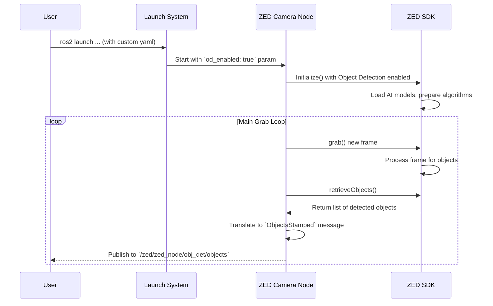

# Chapter 4: Advanced Feature Modules

In the last chapter, [ZED Custom Interfaces (API)](03_zed_custom_interfaces__api__.md), we discovered that the ZED camera uses special "forms" or custom messages to share complex data like a list of detected objects. But where does this intelligent data come from? How does the camera know what an object is or where it is in the world?

This chapter introduces the powerful "brains" behind the data: the **Advanced Feature Modules**.

### More Than Just a Camera

Your ZED camera is much more than a simple webcam. Think of it like a smartphone. A basic phone can make calls, but its true power comes from the apps you can install: a GPS app for navigation, a fitness app for tracking your steps, a camera app with special filters.

The ZED camera is similar. By itself, it captures video. But with the `zed-ros2-wrapper`, you can activate a suite of powerful software "apps" that give it incredible skills. These are the **Advanced Feature Modules**. Each one is a specialized capability, powered by the ZED SDK, that you can turn on or off to match the needs of your project.

### The Key Modules: Your Camera's "Apps"

The wrapper gives you easy access to several of these modules. Here are the most important ones:

*   **Positional Tracking:** This is the camera's personal GPS. It constantly analyzes its surroundings to figure out its own 3D position and orientation. It's the foundation for any robot that needs to navigate.
*   **Object Detection:** This module is the camera's "perception engine." It uses AI to find and identify different types of objects in the scene, like people, vehicles, and animals, and provides their 3D location.
*   **Body Tracking:** A super-powered version of Object Detection. It not only finds people but also identifies the 3D position of their body joints, creating a full skeleton.
*   **Spatial Mapping:** Think of this as the camera's "3D scanner." It can build a detailed 3D mesh model of its environment, which is perfect for creating maps or virtual reality scenes.
*   **GNSS Fusion:** This module combines the camera's Positional Tracking with data from an external GPS device. The result is a hyper-accurate, global position, ideal for outdoor robots and drones.

Each of these modules is an independent "app" you can enable and configure. Let's see how.

### A Practical Example: Giving Your Robot Skills

Let's imagine we want to build a simple security robot. We need it to do two things:
1.  Know where it is as it moves around a room.
2.  Detect any people it sees.

To achieve this, we need to activate two modules: **Positional Tracking** and **Object Detection**. We can do this with a simple configuration file, just like we learned in the [Launch & Configuration System](01_launch___configuration_system_.md) chapter.

#### Step 1: Create a Custom Configuration File

Create a new file named `my_robot_skills.yaml`. This will be our settings file to turn on the new skills.

#### Step 2: Enable the Modules

Inside `my_robot_skills.yaml`, we'll add the "switches" to turn on our desired modules. The settings for all these modules are located in the `common.yaml` file. We just need to override the ones we want to change.

```yaml
# my_robot_skills.yaml

/**:
    ros__parameters:
        pos_tracking:
            pos_tracking_enabled: true # Switch on Positional Tracking

        object_detection:
            od_enabled: true # Switch on Object Detection
            mc_people: true  # Make sure it's looking for people
```

*   `pos_tracking_enabled: true`: This is the master switch for the Positional Tracking module.
*   `od_enabled: true`: This is the master switch for the Object Detection module.
*   `mc_people: true`: This is a sub-setting *within* the Object Detection module that tells it we are specifically interested in detecting people.

That's it! We've told the wrapper which "apps" to install and run.

#### Step 3: Launch the Camera with New Skills

Now, launch the ZED node using your custom configuration file.

```bash
ros2 launch zed_wrapper zed_camera.launch.py \
  camera_model:=zed2i \
  ros_params_override_path:=/path/to/your/my_robot_skills.yaml
```

Your ZED camera is now running with its new skills activated! It's not just streaming video; it's also constantly calculating its own position and searching for people.

#### Step 4: Verify the Skills are Working

How do we know it's working? We can listen to the ROS 2 topics that these modules publish to.

1.  **Check for Position Data:** In a new terminal, listen to the pose topic.

    ```bash
    ros2 topic echo /zed/zed_node/pose
    ```
    You'll see a continuous stream of messages describing the camera's current `position` and `orientation`. If you move the camera, these numbers will change. Positional Tracking is working!

2.  **Check for Object Data:** Now, listen to the objects topic.

    ```bash
    ros2 topic echo /zed/zed_node/obj_det/objects
    ```
    If there are no people in the camera's view, this topic will publish empty lists. But as soon as someone walks in front of the camera, you will see structured data appear, describing the person it found. Object Detection is working!

### Under the Hood

How does flicking a switch in a YAML file activate a complex AI feature? The [ZED Camera Node Component](02_zed_camera_node_component_.md) acts as a manager that orchestrates this process.

#### The Flow of Information



1.  When you launch the node, it reads your `my_robot_skills.yaml` file.
2.  It sees that `object_detection.od_enabled` is set to `true`.
3.  During its initialization, it tells the ZED SDK: "Please enable the Object Detection module and configure it according to these settings."
4.  The ZED SDK, which contains all the complex logic, loads the necessary AI models and prepares itself.
5.  In the main processing loop, after grabbing a new image, the node asks the SDK, "Did you find any objects in this frame?"
6.  The SDK returns a list of found objects, and the node translates this into the custom `ObjectsStamped` message we saw in the last chapter, then publishes it.

The same process happens for Positional Tracking, Mapping, and all the other modules. The YAML file is simply a set of instructions for the ZED node on how to configure the powerful ZED SDK.

#### A Glimpse at the Code

The configuration options you see in `common.yaml` are not just comments; they map directly to parameters in the C++ code.

Here is the section for Object Detection in the `common.yaml` file. It's a menu of all the settings you can control for this specific module.

```yaml
# zed_wrapper/config/common.yaml

object_detection:
    od_enabled: false # True to enable Object Detection
    model: "MULTI_CLASS_BOX_MEDIUM"
    confidence_threshold: 50.0
    mc_people: true
    mc_vehicle: true
    # ... and many more settings
```

Inside the C++ code of the ZED node, there's logic that reads these parameters and uses them to configure the SDK.

```cpp
// Simplified snippet from the ZED Camera Node's initialization logic

// Read the parameter from the YAML file
bool enable_od = this->get_parameter("object_detection.od_enabled").as_bool();

if (enable_od) {
    // If the switch is on, prepare the SDK's object detection module
    sl::ObjectDetectionParameters od_params;
    
    // Configure the module using other parameters from the YAML file
    od_params.detection_model = get_model_from_string(
        this->get_parameter("object_detection.model").as_string()
    );
    // ... configure confidence, tracking, etc. ...
    
    // Finally, tell the SDK to turn the module on
    zed_camera->enableObjectDetection(od_params); 
}
```
This snippet shows the direct link: the node reads a parameter (like `od_enabled`), uses it to make a decision, and then passes other related parameters from the YAML file to the ZED SDK to activate the feature with your exact specifications.

### Conclusion

You now understand that the ZED camera is a multi-talented sensor with a suite of powerful capabilities called **Advanced Feature Modules**. You've learned that:

*   These modules are like "apps" for the camera, providing skills like **Positional Tracking**, **Object Detection**, and **Spatial Mapping**.
*   You can easily enable, disable, and configure each module independently.
*   All configuration is done by overriding parameters from `common.yaml` in your own custom settings file.
*   The ZED node reads your settings and commands the underlying ZED SDK to perform the complex work.

We've successfully given our virtual robot the ability to know where it is in the world. But this position is relative to where the camera started. How do we connect the camera's coordinate system to the robot it's physically mounted on?

In the next chapter, we'll tackle this crucial step: [Robot Integration (URDF & TF)](05_robot_integration__urdf___tf__.md).

---

Generated by [AI Codebase Knowledge Builder](https://github.com/The-Pocket/Tutorial-Codebase-Knowledge)