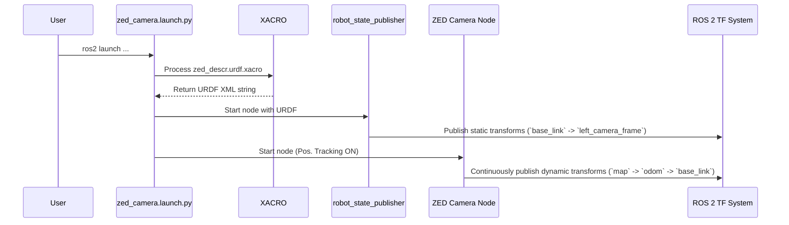

# Chapter 5: Robot Integration (URDF & TF)

In the [Advanced Feature Modules](04_advanced_feature_modules_.md) chapter, we enabled Positional Tracking and saw how the camera could figure out its own position in the world. This is fantastic, but there's a missing piece. The camera's position is relative to where it *started*. How does this connect to the actual robot it's bolted onto? How does the robot's main computer know that the "camera" is located 10cm forward and 20cm up from its own center?

This chapter will teach you how the `zed-ros2-wrapper` solves this crucial problem of integrating the camera into a larger robotic system using two core ROS concepts: **URDF** and **TF**.

### The Problem: A Brain Without a Body Map

Imagine waking up one day and not knowing where your own hands are relative to your head. You could see your hand move, but you wouldn't know it was *your* hand or that it was attached to your arm. This is what a robot experiences without a proper body map.

Our robot needs to know two things:
1.  **The Blueprint:** What is the exact 3D shape of the camera, and where is it physically mounted on the robot's frame?
2.  **The Live Location:** As the robot moves, where is the camera (and all its other parts) in the real world right now?

The `zed-ros2-wrapper` uses URDF to provide the blueprint and TF to provide the live location, giving your robot a complete sense of self.

### The Key Components

Let's break down these two powerful ideas.

#### 1. URDF: The Robot's Blueprint

**URDF** stands for **Unified Robot Description Format**. It's an XML file that acts like a 3D blueprint or a LEGO instruction manual for your robot.

Think of it this way: a URDF file describes two things:
*   **Links:** These are the physical parts of your robot (the camera body, a wheel, a robot arm segment).
*   **Joints:** These describe how the links are connected to each other (e.g., the camera is *fixed* to the robot's chassis, a wheel *rotates* relative to the axle).

The `zed-ros2-wrapper` comes with pre-made URDF files for every ZED camera model. These files describe the camera's body, the precise location of its left and right image sensors, its IMU, and more. When you launch the wrapper, it automatically loads this blueprint.

#### 2. TF: The Robot's Live GPS Network

**TF** (which stands for Transform) is a system in ROS that keeps track of the position and orientation of everything, all the time. It's like giving every single part of your robot its own tiny, live-updating GPS.

The TF system builds a tree of relationships. For example, it might know:
*   The position of the `left_camera_lens` relative to the `camera_body`.
*   The position of the `camera_body` relative to the `robot_chassis`.
*   The position of the `robot_chassis` relative to the `world`.

The wrapper uses TF in two ways:
*   **Static Transforms:** For parts that never move relative to each other (like the camera's sensors relative to its body). This information is read from the URDF blueprint and broadcast once.
*   **Dynamic Transforms:** For parts that move (like the entire camera moving through the room). This is broadcast continuously by the [Advanced Feature Modules](04_advanced_feature_modules_.md) like Positional Tracking.

Together, URDF provides the static body map, and TF provides the live updates for all the moving parts.

### A Practical Example: Visualizing Your Camera in 3D

The best way to understand this is to see it. We're going to launch the camera and use RViz, the standard ROS 2 3D visualizer, to look at its blueprint and watch its live position.

#### Step 1: Launch the ZED Node

The great news is that the default launch command already enables URDF and TF publishing! Open a terminal and run:

```bash
ros2 launch zed_wrapper zed_camera.launch.py camera_model:=zed2i
```
This command starts the ZED node and also a special helper node called `robot_state_publisher`, which reads the URDF blueprint and broadcasts the static transforms.

#### Step 2: Launch RViz

Now, let's open the 3D viewer. The wrapper provides a pre-made configuration file to make this easy. In a **new terminal**, run:

```bash
# Make sure to replace zed2i with your camera model if different
rviz2 -d $(ros2 pkg prefix zed_wrapper)/share/zed_wrapper/config/rviz2/zed2i.rviz
```
An RViz window will open, and you should see a 3D model of your ZED 2i camera! This 3D model is being drawn based on the URDF blueprint.

#### Step 3: See the "Live GPS" in Action

Right now, the camera model is just sitting at the origin. Let's turn on Positional Tracking to make it move.

1.  Stop the launch command in the first terminal (`Ctrl+C`).
2.  We'll use a configuration file to enable tracking. Create a file named `my_tf_test.yaml` with the following:
    ```yaml
    # my_tf_test.yaml
    /**:
        ros__parameters:
            pos_tracking:
                pos_tracking_enabled: true
    ```
3.  Now, launch the node again with this setting:
    ```bash
    ros2 launch zed_wrapper zed_camera.launch.py \
      camera_model:=zed2i \
      ros_params_override_path:=/path/to/your/my_tf_test.yaml
    ```
4.  Look at your RViz window. The camera model is probably still at the origin. In the left panel, under "Global Options," change the **Fixed Frame** from `zed2i_base_link` to `map`.

Now, physically pick up your ZED camera and move it around. You will see the 3D model in RViz move in perfect sync with the real camera! You are now visualizing the dynamic TF broadcast from the Positional Tracking module. The robot's brain now knows exactly where its "eye" is in the world.

### Under the Hood

How does a launch command translate into a moving 3D model? Let's follow the data.

#### The Flow of Information



1.  You run the `ros2 launch` command.
2.  The launch file finds the camera's URDF file (`.urdf.xacro`).
3.  It starts the `robot_state_publisher` node and hands it the URDF blueprint.
4.  The `robot_state_publisher` reads the blueprint and publishes all the static connections (the joints) to the TF system.
5.  The launch file also starts the main [ZED Camera Node Component](02_zed_camera_node_component_.md).
6.  Since Positional Tracking is enabled, the ZED node continuously calculates the camera's position and publishes this dynamic connection (`map` -> `odom` -> `base_link`) to the TF system.
7.  RViz listens to the TF system and uses all this information to draw the robot's parts in their correct positions.

#### A Glimpse at the Code

Let's peek at the blueprint itself. URDF files are often written in a format called XACRO, which just makes them easier to manage.

This snippet from the camera's blueprint defines the main body (`base_link`) and the left camera sensor (`left_camera_frame`), and then creates a `fixed` joint to connect them.

```xml
<!-- File: zed_wrapper/urdf/zed_descr.urdf.xacro -->

<!-- The main body of the camera -->
<link name="${camera_name}_base_link">
  <!-- ... visual and collision properties ... -->
</link>

<!-- The left camera sensor -->
<link name="${camera_name}_left_camera_frame" />

<!-- Connect the base to the left camera with a fixed joint -->
<joint name="${camera_name}_left_camera_joint" type="fixed">
  <parent link="${camera_name}_base_link"/>
  <child link="${camera_name}_left_camera_frame"/>
  <!-- Defines the exact 3D offset -->
  <origin xyz="0 ${-baseline/2.0} 0" rpy="0 0 0" />
</joint>
```

The launch file (`zed_camera.launch.py`) contains the logic to find this file and start the `robot_state_publisher` node.

```python
# File: zed_wrapper/launch/zed_camera.launch.py

# ... code to find the xacro file and prepare the command ...
xacro_command = [...]

# Robot State Publisher node
rsp_node = Node(
    condition=IfCondition(publish_urdf),
    package='robot_state_publisher',
    # ...
    parameters=[{
        'robot_description': Command(xacro_command)
    }]
)
```
This code shows how the launch file passes the processed blueprint (`robot_description`) to the `robot_state_publisher` node, which then does the work of broadcasting the static TFs.

### Conclusion

You now understand the fundamental concepts that allow the ZED camera to become a part of a larger robot. You've learned that:
*   **URDF** is the static "blueprint" that describes the physical parts of the camera and their relationships.
*   **TF** is the "live GPS" system that broadcasts the real-time position of all parts.
*   The `zed-ros2-wrapper` automatically manages both, loading the URDF and publishing dynamic TFs when Positional Tracking is active.
*   You can use RViz to visualize both the robot's model and its live position in the world.

We have now built a complete, configured, and self-aware perception system for a robot. But how do we package this system so we can easily deploy it on different computers or robots without worrying about dependencies and setup?

In the next chapter, we will explore a powerful tool for solving exactly this problem: [Containerized Deployment (Docker)](06_containerized_deployment__docker__.md).

---

Generated by [AI Codebase Knowledge Builder](https://github.com/The-Pocket/Tutorial-Codebase-Knowledge)