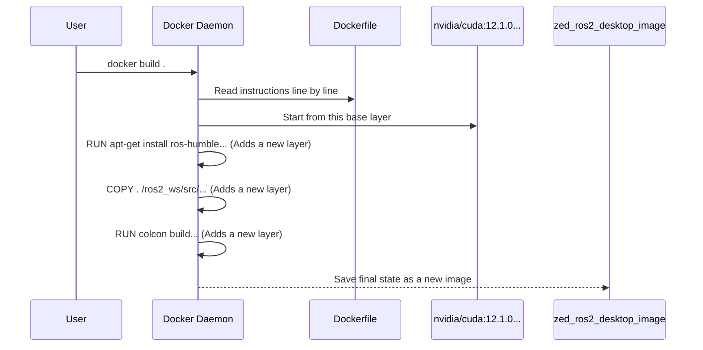

# Chapter 6: Containerized Deployment (Docker)

In the previous chapter on [Robot Integration (URDF & TF)](05_robot_integration__urdf___tf__.md), we successfully created a "body map" for our camera, allowing it to understand its own structure and location in the world. Our perception system is now complete! But a new challenge arises: how do we easily move this entire software stack to another computer, or share it with a teammate, without spending hours reinstalling everything from scratch?

This chapter introduces a powerful solution to this problem: **Containerized Deployment using Docker**.

### The Problem: "But it works on my machine!"

Imagine you've spent days carefully setting up your computer. You installed a specific version of ROS 2, the correct NVIDIA drivers, a compatible CUDA toolkit, and the ZED SDK. Everything works perfectly.

Now, you need to deploy your project onto the actual robot, which has a fresh operating system. Or, a colleague wants to run your code on their laptop. You have to repeat the entire complex setup process. Worse, their machine might have a slightly different graphics driver or library, causing mysterious errors. This is a classic and frustrating problem in software development.

What if you could package your entire working environment—the OS, ROS 2, the ZED SDK, and the wrapper code—into a single, sealed box? You could then give that box to anyone, and it would work identically everywhere, every time. That sealed box is a **Docker container**.

### What is Docker? A Self-Contained Toolkit

Think of Docker as a magical, portable workshop. Instead of buying all the individual tools (a hammer, a screwdriver, a saw) and setting up your own workbench, you get a pre-packaged, sealed toolkit. Inside this toolkit is a complete workbench with every tool you need, perfectly organized and guaranteed to work together.

*   **Dockerfile:** This is the **instruction manual** or "recipe" for building your toolkit. It's a text file that says, "Start with a clean workbench (Ubuntu), install this specific hammer (CUDA 12.1), add this screwdriver (ROS 2 Humble), place the ZED SDK here, and finally, add our wrapper code."
*   **Docker Image:** This is the **finished, sealed toolkit** created from the recipe. It's a lightweight, standalone, and executable package that includes everything needed to run your application.
*   **Docker Container:** This is the toolkit **in use**. When you "run" an image, you create a container. It's like opening the sealed toolkit and starting your work. You can create many separate containers from the same image, just like you can have multiple copies of the same toolkit.

The `zed-ros2-wrapper` project provides you with the "recipes" (Dockerfiles) to build these toolkits for both desktop computers and NVIDIA Jetson devices.

### A Practical Example: Running the Wrapper in a Container

Let's run the ZED node without installing ROS 2 or the ZED SDK directly on our computer. We'll only use Docker.

**Prerequisites:** You need Docker and the NVIDIA Container Toolkit installed on your host machine. This allows Docker to access your computer's GPU, which is essential for the ZED SDK. You can follow the official guides to set this up.

#### Step 1: Build the Docker Image (The Recipe)

The project includes helper scripts to make building the image easy.

1.  Navigate to the `docker` directory in the project.
2.  Run the build script. This command tells Docker to follow the `Dockerfile.desktop-humble` recipe to build a toolkit for an Ubuntu 22.04 desktop with CUDA 12.1 and ZED SDK 4.1.2.

```bash
cd docker
./desktop_build_dockerfile_from_sdk_ubuntu_and_cuda_version.sh \
  ubuntu22.04 cuda12.1.0 zedsdk4.1.2
```
This process might take some time as Docker downloads all the necessary components and assembles your "toolkit." When it's done, you'll have a new Docker image named `zed_ros2_desktop_image`.

#### Step 2: Run the Docker Container (Open the Toolkit)

Now that we have our sealed toolkit, let's open it and get a command-line prompt inside.

```bash
docker run --runtime nvidia -it --privileged \
  -v /dev:/dev \
  zed_ros2_desktop_image
```
Let's break down this command:
*   `docker run`: The basic command to start a new container.
*   `--runtime nvidia -it --privileged`: These are crucial options that give the container secure access to your computer's GPU and hardware devices.
*   `-v /dev:/dev`: This mounts your computer's `/dev` directory into the container. This is how the container can see the ZED camera connected via USB.
*   `zed_ros2_desktop_image`: The name of the image we want to run.

Your terminal prompt will change. You are now "inside" the container, a completely isolated Linux environment.

#### Step 3: Launch the ZED Node (Use the Tools)

Inside the container, everything is already installed and configured. You can now run the exact same ROS 2 commands you've learned in the previous chapters.

```bash
# This command is run INSIDE the container
ros2 launch zed_wrapper zed_camera.launch.py camera_model:=zed2i
```
And that's it! The ZED camera node starts up, just as it did before. But this time, it's running in a clean, isolated, and portable environment. You didn't have to install a single thing on your host machine (besides Docker).

### Under the Hood

How does a simple text file become a fully functional operating environment?

#### The Build Process

The `docker build` command follows the recipe in the `Dockerfile` step-by-step to create the image.


Docker works with a system of layers. Each instruction in the Dockerfile (like `RUN` or `COPY`) creates a new layer on top of the previous one. This makes the process efficient, as layers can be cached and reused. The final image is simply a pointer to this stack of layers.

#### A Glimpse at the Dockerfile

You don't need to write Dockerfiles to use this project, but seeing one helps demystify the process. Here is a heavily simplified version of `Dockerfile.desktop-humble`.

```dockerfile
# File: docker/Dockerfile.desktop-humble

# 1. Start from an official NVIDIA image with Ubuntu and CUDA
FROM nvidia/cuda:12.1.0-cudnn8-devel-ubuntu22.04

# 2. Set arguments for versions we want to install
ARG ZED_SDK_VERSION=4.1.2
ARG ROS_DISTRO=humble

# 3. Install ROS 2 and other system dependencies
RUN apt-get update && apt-get install -y \
    ros-${ROS_DISTRO}-desktop \
    # ... other tools

# 4. Download and run the ZED SDK installer inside the image
RUN wget https://download.stereolabs.com/zedsdk/${ZED_SDK_VERSION}/...
RUN ./ZED_SDK_Linux_... -- silent

# 5. Copy the zed-ros2-wrapper source code into the image
COPY . /opt/ros2_ws/src/zed-ros2-wrapper

# 6. Build the wrapper code inside the image
RUN . /opt/ros/humble/setup.sh && \
    cd /opt/ros2_ws && colcon build
```
As you can see, it's just a script that automates the exact same steps you would have performed manually. It starts with a base system, installs dependencies, and builds the code, packaging the result into a reusable image.

### Conclusion

You have now learned how to package and deploy the entire `zed-ros2-wrapper` application in a clean, portable, and reproducible way using Docker. You know that:

*   Docker solves the "it works on my machine" problem by packaging the application and all its dependencies into a **container**.
*   A **Dockerfile** is the recipe, an **Image** is the sealed toolkit, and a **Container** is the toolkit in use.
*   The project provides Dockerfiles and scripts to easily build images for both desktop and Jetson platforms.
*   Running the wrapper in a container provides isolation and ensures your setup will work identically on any machine with Docker installed.

Now that we can automatically build these powerful, self-contained Docker images, how can we automate the process even further? What if we could automatically build, test, and even publish a new Docker image every single time we update the code?

This is the role of a Continuous Integration and Continuous Deployment pipeline, which we will explore in the final chapter: [CI/CD Pipeline](07_ci_cd_pipeline_.md).

---

Generated by [AI Codebase Knowledge Builder](https://github.com/The-Pocket/Tutorial-Codebase-Knowledge)