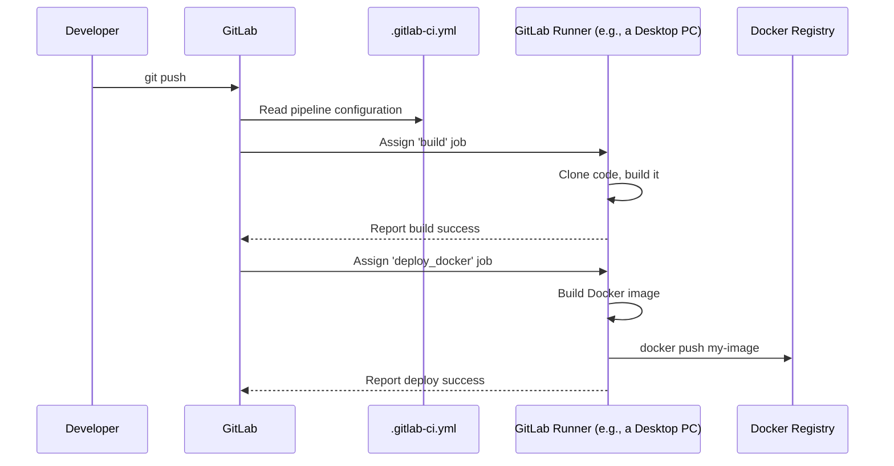

# Chapter 7: CI/CD Pipeline

In the previous chapter on [Containerized Deployment (Docker)](06_containerized_deployment__docker__.md), we learned how to package the entire `zed-ros2-wrapper` into a clean, portable "toolkit" using Docker. This is a huge step towards making our project easy to deploy. But a new question emerges: how do we ensure that every single code change we make doesn't accidentally break something? And how can we automate the process of building these Docker toolkits?

This final chapter introduces the ultimate automation system that works behind the scenes on this project: the **CI/CD Pipeline**.

### The Automated Assembly Line

Imagine you are part of a team designing a car. Every day, engineers make small changes: one person adjusts a mirror, another tweaks the engine, and a third redesigns a door handle. It would be a nightmare to manually rebuild the entire car and run a full set of safety tests for every single change.

Instead, modern factories use an automated assembly line with built-in quality control. When a new part design is submitted, the line automatically:
1.  Builds a new car with the new part.
2.  Runs it through a series of automated checks (crash tests, emissions tests).
3.  If it passes all checks, it packages the car for delivery.

The **CI/CD Pipeline** is exactly this for software. It's an automated assembly line and quality control system for the `zed-ros2-wrapper`. Every time a developer makes a change, the pipeline automatically builds the project, runs it through a series of checks, and packages it for distribution.

### What is CI/CD?

CI/CD stands for two complementary practices:

*   **Continuous Integration (CI):** This is the "build and test" part of the assembly line. As soon as a developer "integrates" a new code change, the system automatically builds the software and runs tests to make sure the new change didn't break anything.
*   **Continuous Deployment (CD):** This is the "package and release" part. If the CI phase passes all its checks, the system automatically packages the software (like creating a Docker image) and deploys it, making it available for users.

For the `zed-ros2-wrapper`, this is all managed by a tool called **GitLab CI**, using a single configuration file as its blueprint.

### The Key Components of Our Assembly Line

The entire process is defined in one file in the project's root directory: `.gitlab-ci.yml`. Think of this file as the master blueprint for the entire factory. It defines:

*   **Stages:** These are the major sections of our assembly line. The wrapper has stages like `build`, `unit_test`, and `deploy_docker`. Jobs in one stage must complete successfully before the next stage can begin.
*   **Jobs:** A job is a specific task within a stage. For example, the `build` stage has two separate jobs: one to build the wrapper for desktop computers (`x86_64`) and another to build it for NVIDIA Jetsons (`aarch64`).
*   **Runners:** These are the actual machines (the "robots" on the assembly line) that perform the jobs. The project has different runners available: some are powerful desktop computers for building, and some are actual Jetson devices for testing.

### A Practical Example: Following a Code Change

You don't need to run the pipeline yourself—it runs automatically! But let's follow the journey of a single code change to see how it works.

**Scenario:** A developer fixes a small bug and pushes the new code to the project's GitLab repository.

#### Step 1: The Pipeline Starts

As soon as the code is pushed, GitLab sees the new commit and automatically starts a new pipeline based on the instructions in `.gitlab-ci.yml`.

#### Step 2: The `build` Stage

The pipeline begins with the `build` stage. Two jobs start in parallel:
*   **`humble_u22_cu117_build`:** GitLab assigns this job to a powerful desktop "runner." This machine builds the wrapper code for a standard x86_64 architecture.
*   **`humble_l4t35_1_build`:** GitLab assigns this job to a special "runner" that can build code for the aarch64 architecture used by Jetson devices.

The pipeline dashboard will show these jobs running. If a job fails (e.g., the code has a syntax error), the developer is notified immediately.

#### Step 3: The `unit_test` Stage

If both build jobs succeed, the pipeline can move to the `unit_test` stage. These jobs take the software built in the previous stage and run a series of automated checks to ensure all features are working correctly. This might involve running the code on a real Jetson device with a ZED camera attached to it.

#### Step 4: The `deploy_docker` Stage

If all tests pass, the pipeline moves to the final stage: `deploy_docker`. This stage uses the Dockerfiles we learned about in the [previous chapter](06_containerized_deployment__docker__.md) to:
1.  Build new Docker images containing the freshly compiled wrapper.
2.  Push these images to a public container registry, making them available for anyone to download and use.

The entire process, from code push to new Docker image, happens automatically, ensuring that every change is validated across all supported platforms and that users always have access to a tested, working version.

### Under the Hood

How does a simple YAML file orchestrate this complex, multi-platform process?

#### The Flow of Information



1.  A developer pushes code.
2.  GitLab triggers the pipeline defined in `.gitlab-ci.yml`.
3.  It finds the first available job, like `humble_u22_cu117_build`.
4.  It finds a compatible Runner (a machine tagged for building desktop Linux code) and assigns the job to it.
5.  The Runner executes the `script` defined for that job, building the code.
6.  Once all build and test jobs are done, a deployment job is assigned to a Runner.
7.  That Runner builds a new Docker image and pushes it to the Docker Registry.

#### A Glimpse at the "Blueprint"

Let's look at some simplified snippets from the `.gitlab-ci.yml` file to see how these jobs are defined.

First, the stages are defined in order.

```yaml
# File: .gitlab-ci.yml

stages:
  - build
  - unit_test
  - deploy_docker
```
This tells GitLab the overall structure of the assembly line.

Next, here's a simplified definition for the desktop build job.

```yaml
# File: .gitlab-ci.yml

humble_u22_cu117_build:
  stage: build  
  image: myzhar/test:ubuntu22.04-cuda11.7-... # The Docker image to build inside
  tags:
    - docker-builder # Tells GitLab to use a desktop runner
  script:
    - ./.ci/run_build_in_humble.sh # The command to actually run
```
*   `stage: build`: Places this job in the `build` stage.
*   `image`: Specifies a base Docker image to use for the build environment. This ensures the build happens in a clean, consistent place.
*   `tags`: This is how the job is matched with the correct "robot" (Runner).
*   `script`: The actual commands the Runner will execute.

Finally, here is a simplified version of the job that deploys the Docker image.

```yaml
# File: .gitlab-ci.yml

ros2_humble_u22_docker_image_dev:
  stage: deploy_docker
  image: docker # Use a simple image that has Docker tools
  script: 
    - docker login -u $CI_REGISTRY_USER -p $CI_REGISTRY_PASSWORD
    - cd docker
    - ./desktop_build_dockerfile_from_sdk_...
    - docker push myzhar/zed-ros2-devel:new-tag
```
This job's script simply logs into the Docker registry, runs the build script from the `docker` directory, and pushes the final image.

### Conclusion

You have now seen the powerful automation that works behind the scenes to keep the `zed-ros2-wrapper` reliable and up-to-date. You've learned that:

*   A **CI/CD Pipeline** is like an automated assembly line for software.
*   It automatically **builds**, **tests**, and **deploys** the wrapper every time a change is made.
*   This process is defined in the `.gitlab-ci.yml` file, which specifies stages, jobs, and the runners to execute them.
*   This automation ensures high quality, consistency across platforms (desktop and Jetson), and provides ready-to-use Docker images for the community.

---

### A Final Word

Congratulations on completing the tutorial for the `zed-ros2-wrapper`!

Over these seven chapters, you've gone from launching your camera for the first time to understanding its deepest components. You've learned about the flexible [Launch & Configuration System](01_launch___configuration_system_.md), the core [ZED Camera Node Component](02_zed_camera_node_component_.md), the custom API that communicates rich data, the powerful [Advanced Feature Modules](04_advanced_feature_modules_.md), how to integrate it with a robot using [URDF & TF](05_robot_integration__urdf___tf__.md), and finally, how to package and automate it all with [Docker](06_containerized_deployment__docker__.md) and a **CI/CD Pipeline**.

You now have the foundational knowledge to integrate Stereolabs' advanced 3D perception into your ROS 2 projects. The world of robotics is vast and exciting, and we can't wait to see what you build. Happy coding

---

Generated by [AI Codebase Knowledge Builder](https://github.com/The-Pocket/Tutorial-Codebase-Knowledge)