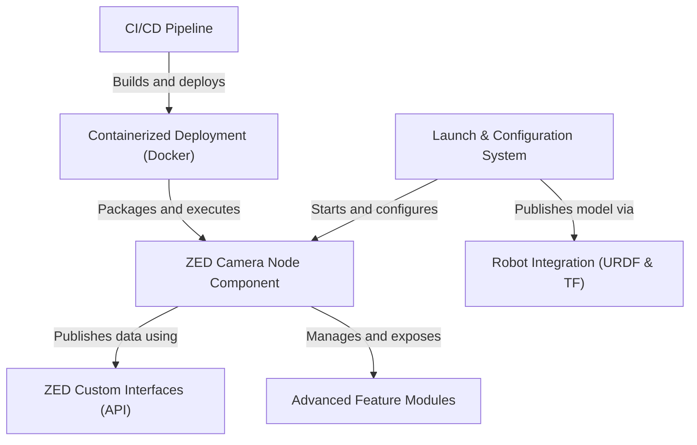

# Tutorial: zed-ros2-wrapper

This project is a **ROS 2 driver** for Stereolabs ZED cameras, acting as a *bridge* to connect the camera's powerful 3D vision capabilities with the robotics software ecosystem. It allows a robot to stream essential data like *images*, *depth maps*, and *3D point clouds*. More importantly, it unlocks the camera's built-in AI, providing advanced features like **object detection**, **body tracking**, and **real-time positional tracking** directly within ROS 2. Users can easily enable and customize these features through configuration files, making it a versatile tool for navigation, perception, and interaction tasks.

**Source Repository:** [None](None)

## Chapters

1. [Launch & Configuration System
](01_launch___configuration_system_.md)
2. [ZED Camera Node Component
](02_zed_camera_node_component_.md)
3. [ZED Custom Interfaces (API)
](03_zed_custom_interfaces__api__.md)
4. [Advanced Feature Modules
](04_advanced_feature_modules_.md)
5. [Robot Integration (URDF & TF)
](05_robot_integration__urdf___tf__.md)
6. [Containerized Deployment (Docker)
](06_containerized_deployment__docker__.md)
7. [CI/CD Pipeline
](07_ci_cd_pipeline_.md)

---

Generated by [AI Codebase Knowledge Builder](https://github.com/The-Pocket/Tutorial-Codebase-Knowledge)